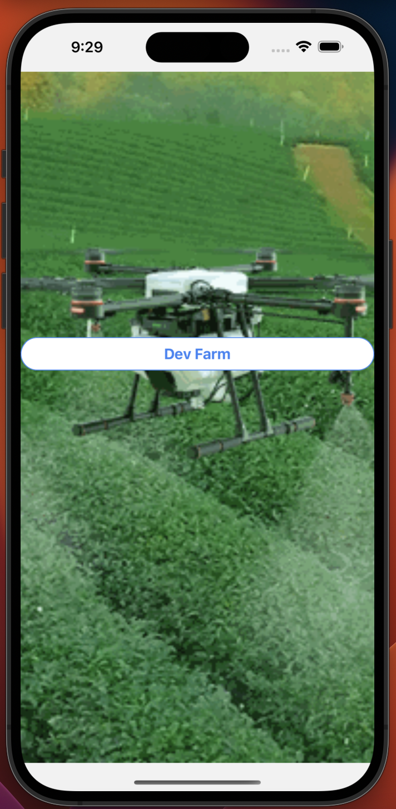
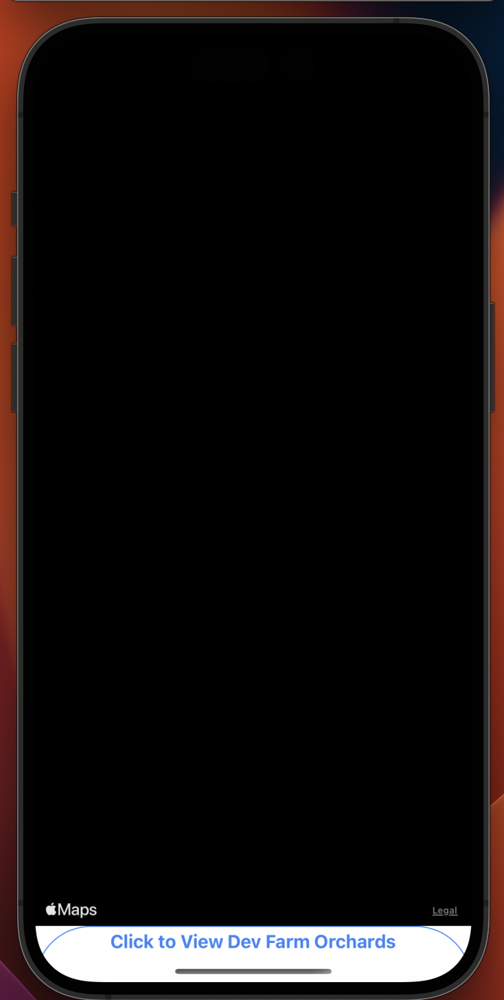
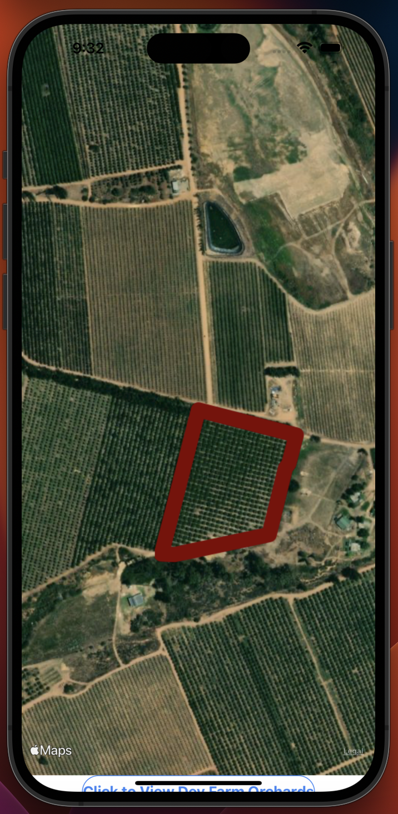

# list-of-farms

## Demonstration

Clone the source code into your computer.  
` git clone https://github.com/ludmilpaulo/list-of-farms.git` 
Install the project's dependencies  
`yarn install` 
run the app  
`npx expo start` 

## Screashoots

### NB: you should click to trigger the orchard

